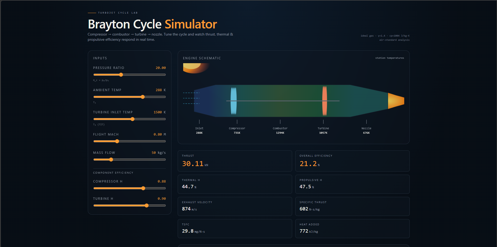

# Brayton Cycle Simulator

Interactive turbojet Brayton-cycle simulator built with TanStack Start, React, and Vite.



## Features

- Real-time cycle simulation
- Engine schematic and station temperatures
- Performance metrics (thrust, efficiencies, TSFC, heat added)
- Adjustable thermodynamic and flight inputs

## Development

### Install

```bash
npm install
```

### Run locally

```bash
npm run dev
```

### Production build

```bash
npm run build
```

## Deployment

This project is configured for Vercel SSR deployment through Nitro.

## Notes

Place the screenshot you shared at:

- docs/brayton-simulator.png
